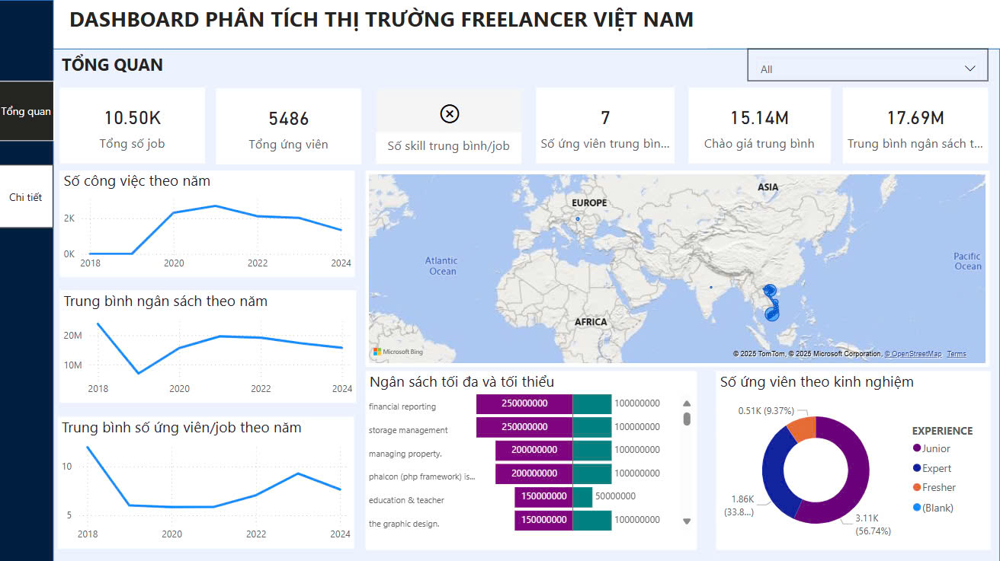
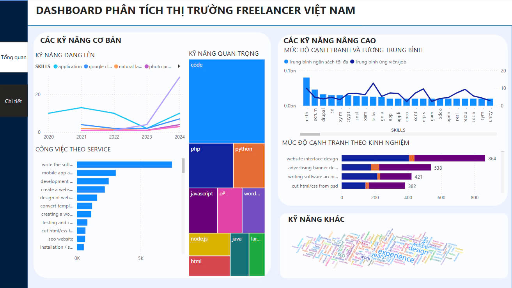

# Final_AIDA

This project demonstrates a comprehensive data pipeline for aggregating, processing, and visualizing freelance job opportunities from multiple sources, including Vietnam-based and international job boards. The pipeline extracts job data using web crawling techniques, transforms and cleans the data using Python, and loads it into Azure SQL Database for storage. Apache Airflow orchestrates the end-to-end workflow, ensuring seamless scheduling and automation. Power BI is used for advanced data exploration and visualization, while a Streamlit-based dashboard provides real-time insights for end-users. The platform also integrates the Gemini API to enable natural language queries for non-technical users and includes a CV comparison tool to help job seekers match their skills with job requirements.

## Dashboard

